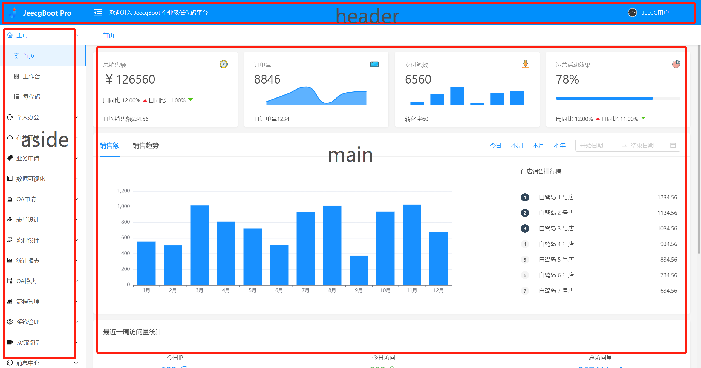

# rabbit
前端项目

## 项目介绍
### admin 为后台代码

技术栈： 

1. vue3
2. pinia
3. vue-router
4. element-plus

### mobile-uni 为c端代码

技术栈：

1. vue3
2. pinia
3. uniapp

一个后台+一个c端
### 后台
#### 登录 && 注册

1. 左边展示项目信息、logo；右侧展示登录表单
   - 点击登录按钮时校验用户输入的信息

   - 点击记住账号，登录成功之后 把账号信息加密放置缓存中

     

   - 

2. 注册页

   - 三个输入框，一个用户名、一个密码、一个确认密码；按钮文案修改为注册
   - 用户名位数不限制，密码至少八位数，中英文混合，
   - 点击注册时校验 两次密码是否一致，密码是否时八位数、中英文混合；
   

3. 首页

   - header  + aside + main
   - header 展示 logo  用户头像+用户名称
     - 无头像则展示默认头像
     - 无名称展示登录账号
   - aside 展示菜单栏
     - icon + 菜单名称
     - 点击菜单 展示对应的菜单视图
   - main 展示主视图

   

4. h5端首页配置

   - 左侧实时预览；右侧配置

5. 商品列表页

   - 商品列表
   - 商品新增/商品编辑
   - 商品分类

6. h5端用户列表

7. 用户信息设置页

   - 可以编辑用户名称头像

### c端
1. 首页 轮播图+ 商品
   - 轮播图
   - 商品列表
2. 商品分类
3. 个人中心
4. 登录