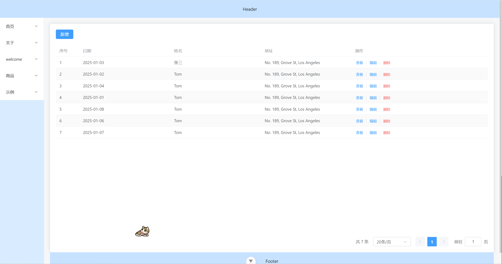
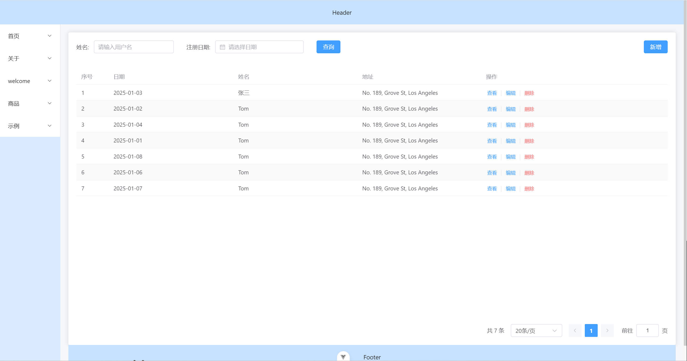

# rabbit
前端项目

## 项目介绍
### admin 为后台代码

技术栈： 

1. vue3
2. pinia
3. vue-router
4. element-plus

### mobile-uni 为c端代码

技术栈：

1. vue3
2. pinia
3. uniapp

一个后台+一个c端
### 后台
#### 登录 && 注册

1. 左边展示项目信息、logo；右侧展示登录表单
   - 点击登录按钮时校验用户输入的信息

   - 点击记住账号，登录成功之后 把账号信息加密放置缓存中

     

   - 

2. 注册页

   - 三个输入框，一个用户名、一个密码、一个确认密码；按钮文案修改为注册
   - 用户名位数不限制，密码至少八位数，中英文混合，
   - 点击注册时校验 两次密码是否一致，密码是否时八位数、中英文混合；
   

3. 首页

   - header  + aside + main
   - header 展示 logo  用户头像+用户名称
     - 无头像则展示默认头像
     - 无名称展示登录账号
     - 左侧展示slogan，右侧展示用户头像+昵称+退出登录按钮
     - 点击退出登录使用element 的 [confirm](https://element-plus.org/zh-CN/component/message-box.html)组件进行二次提示；提示文案为：确认退出登录？；点击确认之后跳转到登录页同时清空token以及用户信息
   - aside 展示菜单栏
     - icon + 菜单名称
     - 点击菜单 展示对应的菜单视图
   - main 展示主视图

   

4. h5端轮播图配置

   - 点击新增 弹出弹窗 
   - 弹窗内使用element-ui 的[上传组件](https://element-plus.org/zh-CN/component/upload.html),上传图片
      - 对文件格式进行限制 只能上传图片格式
      - 对文件大小进行限制，不超过2M

   

5. 商品列表页

   - 商品列表
     - 列表字段：序号，商品id，商品名称，商品价格，商品图片，商品描述，商品类别，商品库存
     - 搜索字段：商品id，商品名称
   - 商品新增/商品编辑
     - 商品名称，限制20个字符
     - 商品价格，只能输入正整数且最多两位小数
     - 商品图片，大小限制2M
     - 商品描述，限制200个字符
     - 商品类别，选择框，数据来自商品分类表
     - 商品库存，只能输入大于0的正整数
   - 商品分类
     - 列表字段：序号，类别id，类别名称
     - 新增/编辑：类别名称限制5个字符

   

6. h5端用户列表

   - 列表字段：序号，用户id，用户名，手机号，头像，性别
   - 搜索字段：用户id，用户名，手机号
   
   

### c端
1. 首页 轮播图+ 商品
   - 轮播图
   - 商品列表
2. 商品分类
3. 个人中心
4. 登录